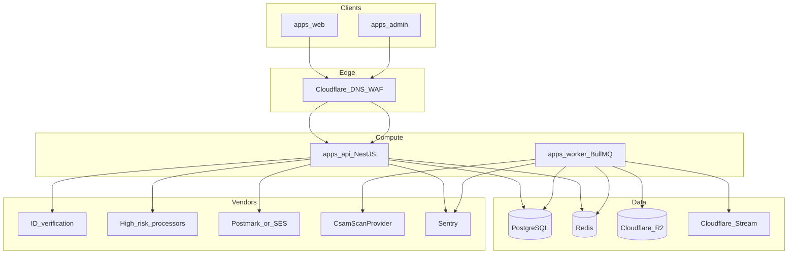

# hushd — system architecture

## Purpose

Web-first adult creator subscription platform: subscriptions, PPV messages, tips, mandatory age/ID verification, creator KYC, high-risk payment processor adapters, and a **staging-first media pipeline** with pre-storage CSAM scanning hooks.

## Deployment topology

## Upload and ingest flow

1. Client calls **init upload**; API returns **presigned URL** scoped to a **staging prefix** only.
2. Client uploads bytes to R2 staging.
3. Client calls **complete upload**; API enqueues **scan and ingest** job.
4. Worker runs **hash/vendor CSAM scan**; on failure, object is **deleted or quarantined** and moderation events are written.
5. On success, video is sent to **Cloudflare Stream** where applicable; metadata is finalized in PostgreSQL; a **watermark job** may run before promotion.
6. **Promotion** moves or re-keys objects from staging to non-staging prefixes; **signed URLs** are issued at read time.

## Financial model

- **Ledger-friendly `Transaction` rows** capture processor charges, tips, PPV, refunds, and chargebacks.
- **Platform fee** (default 15%, configurable) is derived from policy stored in `PlatformConfig` / creator agreements (exact rules are product/legal inputs).
- **Immutable `AuditLog`** records every mutation that affects earnings, payouts, or compliance state.

## Service boundaries (NestJS modules)

| Module | Responsibility |
|--------|------------------|
| `auth` | Credentials, refresh rotation, sessions, OAuth hooks, creator TOTP enforcement |
| `verification` | IDV webhooks, verification state machines |
| `billing` | Processor adapters, webhooks, subscription state |
| `ledger` | Transaction writes, fee calculation helpers |
| `media` | Init/complete upload, signed URL policy |
| `messaging` | Conversations, PPV unlock |
| `moderation` | Reports, queue, DMCA linkage |
| `admin` | Admin-only routes (separate deploy and IAM) |
| `risk` | Rate limits, geo allowlists, anomaly hooks |

## Secrets and configuration

- No secrets in git. Use environment variables in development and a **secrets manager** in production.
- Webhook endpoints verify **per-vendor signatures** (see `apps/api` integration stubs).

## Related documents

- [scope-assumptions.md](./scope-assumptions.md)
- [openapi.yaml](./openapi.yaml)
- [runbooks](./runbooks/)
