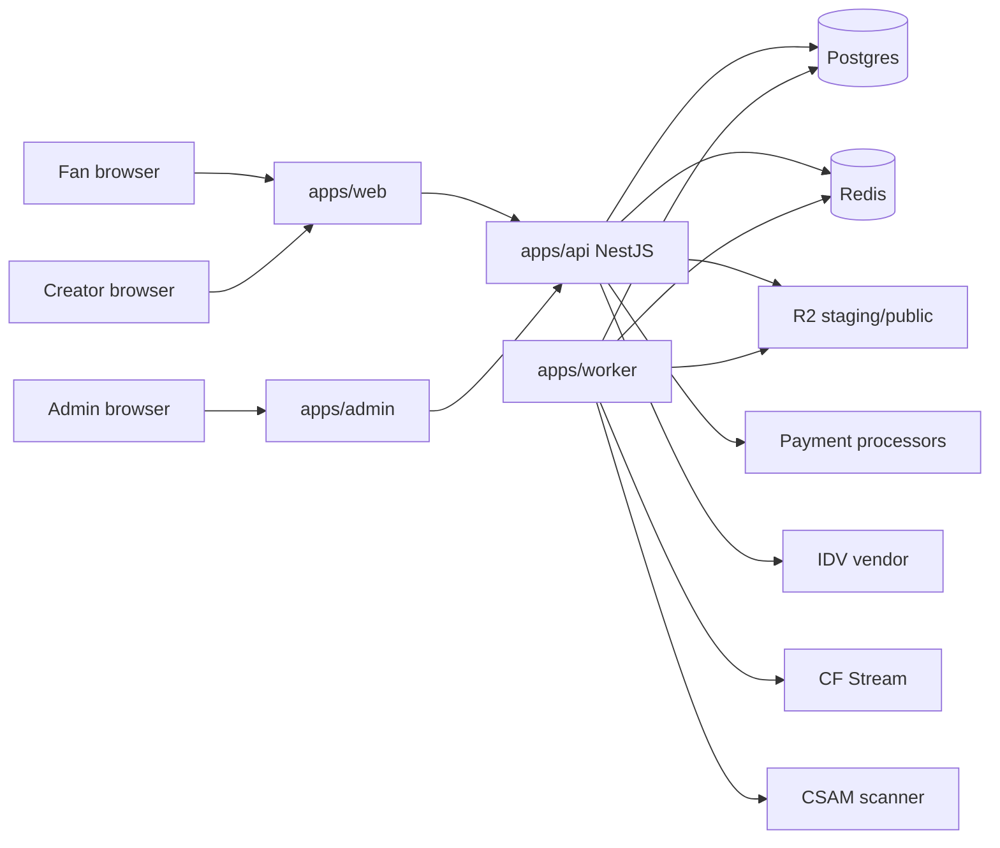

# Architecture

Companion to the shorter [`architecture.md`](architecture.md) baseline notes. ADRs: [`adr/0000-index.md`](adr/0000-index.md).

## System context

hushd is a compliance-oriented creator subscription platform: fans subscribe and purchase content; creators publish media under verification and safety gates; admins operate moderation, payouts, and risk.

## Components and boundaries

| Component | Responsibility | Must not |
|-----------|----------------|----------|
| `apps/web` | Fan/creator UX | Enforce authz alone |
| `apps/admin` | Operator UX | Bypass RoleGuard |
| `apps/api` | HTTP contracts, authz, ledger, webhooks | Long CSAM scan in-request |
| `apps/worker` | Media scan/promote, reconcile, sweeps | Trust client staging keys |
| `packages/db` | Schema ownership | App-specific business rules |
| `packages/shared` | Adapters, money, job types, policy helpers | Nest/Next imports |

## Data flows (selected)

1. **Subscribe:** web → billing checkout → processor webhook → ledger + subscription → feed entitlement
2. **Upload:** init presign → client PUT staging → complete → queue → CSAM → promote/public or quarantine
3. **Payout:** creator request → balance/KYC/hold/geo checks → admin approve → paid + ledger

## Trust boundaries

- Public internet → API (JWT, throttles, CORS, geo edge secret)
- Processor/IDV → webhook controllers (HMAC)
- Client → R2 (presigned, short TTL)
- Admin mutations → AuditLog

## AuthN / AuthZ

See [`SECURITY.md`](SECURITY.md). Roles: FAN, CREATOR, ADMIN. Verification policy decorator gates creator actions.

## Deployment topology

Four deployable units (api, worker, web, admin) + managed Postgres/Redis/R2. Local compose provides Postgres/Redis only. Terraform under `infra/terraform` is a skeleton.

## Scaling assumptions

- API horizontally scalable behind sticky-less JWT auth; Redis shared for throttles/queues
- Worker concurrency via BullMQ; CSAM rate limits vendor-dependent
- Postgres primary for transactional ledger; analytics not yet warehouse-backed
