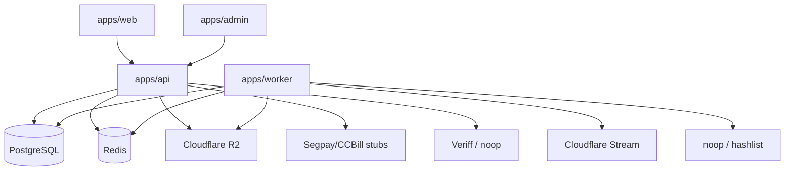

# 01 — Repository Inventory

| Field | Value |
|-------|-------|
| Audit branch | `audit/production-hardening` |
| Baseline commit | `e3cf076` (`feat: implement competitor-grade hushd roadmap`) |
| Audit date | 2026-08-01 |
| Package manager | pnpm 9.14.2 |
| Runtime | Node.js 22 (Docker), TypeScript 5.x |

## System map

| Path | Role | Entry points |
|------|------|--------------|
| `apps/web` | Fan + creator Next.js 15 App Router | `app/**`, port 3000 |
| `apps/admin` | Admin Next.js 15 console | `app/**`, port 3010 |
| `apps/api` | NestJS 10 HTTP API (`/v1`) | `src/main.ts`, port 3001 |
| `apps/worker` | BullMQ media + reconcile + sweeps | `src/main.ts` |
| `packages/db` | Prisma 6 schema + migrations | `prisma/schema.prisma` |
| `packages/shared` | Adapters, money, webhooks, jobs, policy | `src/index.ts` |
| `infra/terraform` | Infra skeleton (not production-complete) | modules placeholders |
| `docs/` | Architecture, ADRs, audit, runbooks | — |
| `.github/workflows/` | CI, deploy, security | `ci.yml` et al. |

## Runtime topology

- **API guards (order):** `ThrottlerGuard` → `GeoBlockGuard` → `JwtAuthGuard` → `RoleGuard`
- **Observability:** request IDs, Prometheus `/v1/metrics`, optional Sentry, structured exception filter
- **Throttling:** Redis-backed storage (fails closed if Redis unavailable)
- **Data:** single Prisma schema; integer cents for money; double-entry ledger

## Validation commands (authoritative)

| Action | Command |
|--------|---------|
| Install | `pnpm install` |
| Typecheck | `pnpm typecheck` |
| Unit tests | `pnpm test` |
| Lint | `pnpm lint` |
| Production build | `pnpm build` |
| Migrate (dev) | `pnpm db:migrate` |
| Migrate (deploy) | `pnpm db:migrate:deploy` |
| Dep audit | `pnpm audit:deps` |
| Local deps | `docker compose up -d` (Postgres **5433**, Redis **6379**) |
| Dev apps | `pnpm dev` |
| Docker images | `docker build -f apps/{api,web,admin,worker}/Dockerfile .` |

## Trust boundaries

| Boundary | Notes |
|----------|-------|
| Browser → API | JWT Bearer from localStorage; CORS allowlist required in production |
| Edge → API | Geo country headers trusted only with `GEO_EDGE_SHARED_SECRET` in production |
| Processors → API | HMAC webhook verification + idempotent `ProcessorEvent` |
| IDV vendor → API | Signature verify; noop fails closed |
| Upload client → R2 | Presigned staging PUT; promote only after worker CSAM gate |
| Admin UI → API | Server-side `@RequireRole(ADMIN)`; UI gate is not sufficient alone |

## Critical user journeys (implemented in UI + API)

1. Register → verify email (when `AUTH_AUTO_ACTIVATE=false`) → login / TOTP
2. Creator profile/tiers/posts → media init/complete → worker scan → feed entitlement
3. Fan subscribe (real `tierId`) → checkout stub → webhook ledger → gated feed
4. Messaging / PPV unlock / tips with ledger
5. Creator payout account + request → admin approve/paid with holds + geo rules
6. Admin moderation, DMCA, geo-blocks, compliance/2257, audit logs, risk

## Abandoned / deferred

| Item | Status |
|------|--------|
| Watermark job | Typed in shared; **not implemented** in worker |
| Live Segpay/CCBill | Stub adapters only |
| Real CSAM vendor | noop default; hashlist optional |
| Real email | `MailerService` log provider only |
| Terraform production modules | Skeleton |
| OpenAPI | Drifted vs controllers |
| Frontend automated tests | Echo stubs only |
