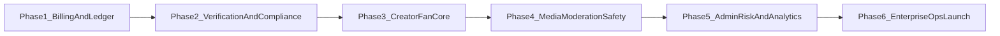

# Competitor-Grade Build Roadmap

## Current baseline (already in repo)

- Monorepo skeleton exists across [`apps/web`](apps/web), [`apps/admin`](apps/admin), [`apps/api`](apps/api), [`apps/worker`](apps/worker), [`packages/shared`](packages/shared), [`packages/db`](packages/db), and [`infra/terraform`](infra/terraform).
- Auth foundation is present in [`apps/api/src/auth/auth.service.ts`](apps/api/src/auth/auth.service.ts) with register/login/refresh/logout and creator TOTP.
- Media queue skeleton exists in [`apps/api/src/media/media.service.ts`](apps/api/src/media/media.service.ts) and [`apps/worker/src/main.ts`](apps/worker/src/main.ts).
- OpenAPI is still a skeleton in [`docs/openapi.yaml`](docs/openapi.yaml).

## Roadmap strategy

Implement in 6 controlled phases so each phase ends in a deployable, testable milestone and reduces existential risk (billing correctness, legal posture, abuse controls).

## Phase 1 — Dual billing + ledger correctness (Segpay + CCBill)

**Goal:** Money flow is deterministic, auditable, idempotent.

- Add `billing` and `ledger` modules in [`apps/api/src`](apps/api/src) with processor-specific adapters under `integrations/segpay` and `integrations/ccbill`.
- Replace stub event parsing in [`apps/api/src/webhooks/billing-webhook.controller.ts`](apps/api/src/webhooks/billing-webhook.controller.ts) with:
  - raw-body signature verification
  - idempotency keys
  - canonical event mapping (`subscription_charge`, `renewal`, `refund`, `chargeback`, `cancel`)
- Extend schema in [`packages/db/prisma/schema.prisma`](packages/db/prisma/schema.prisma) for:
  - `ProcessorEvent` (dedupe + replay-safe ingestion)
  - `LedgerEntry` (double-entry)
  - stronger transaction linkage (`subscription_id`, `invoice_ref`, `chargeback_ref`)
- Add reconciliation jobs in [`apps/worker/src`](apps/worker/src): processor settlement sync + discrepancy alerts.
- Expand API contract in [`docs/openapi.yaml`](docs/openapi.yaml): subscription create/cancel, webhook acknowledgements, payment history.

**Acceptance:** replaying the same webhook payload N times yields exactly one financial mutation.

## Phase 2 — Verification and legal-compliance workflow hardening

**Goal:** No bypasses for age/ID/KYC gates; immutable compliance evidence links.

- Build `verification` module in [`apps/api/src/verification`](apps/api/src/verification) with state machines for:
  - user age verification
  - creator ID + selfie match
  - creator tax form intake and review
- Add policy enforcement guards so protected actions require verified states (posting, payouts, subscriptions where needed by jurisdiction).
- Add immutable compliance/audit emission wrapper across sensitive mutations (beyond ad hoc calls), writing to `AuditLog` and compliance event table.
- Add jurisdiction policy engine (`allowlist`, geo-block, payout eligibility) in [`packages/shared`](packages/shared) and config docs in [`docs/scope-assumptions.md`](docs/scope-assumptions.md).
- Produce legal operations docs in [`docs/runbooks`](docs/runbooks) for 2257 records handling, evidence retention, and takedown chains.

**Acceptance:** test matrix proves blocked access when verification states are missing/expired.

## Phase 3 — Creator/fan monetization core features

**Goal:** Core product loops work end-to-end and are billing-integrated.

- Implement modules/routes for tiers/subscriptions/posts/messages/PPV/tips:
  - `creator` + `feed` + `messaging` modules in [`apps/api/src`](apps/api/src)
  - UI flows in [`apps/web`](apps/web) for creator publishing and fan purchase journeys
- Implement subscription lifecycle transitions (trial, active, grace/past_due, canceled, lapsed).
- Add pricing/rules engine for promotions, trials, and affiliate attribution.
- Add high-signal integration tests around purchase/entitlement boundaries.

**Acceptance:** a fan can subscribe, access gated content, buy PPV, and tip with full transaction traceability.

## Phase 4 — Media, moderation, and safety pipeline completion

**Goal:** Upload path enforces safety and secure delivery before any public serving.

- Replace placeholder signed URLs in [`apps/api/src/media/media.service.ts`](apps/api/src/media/media.service.ts) with real R2 presigning adapter.
- Complete worker pipeline in [`apps/worker/src/main.ts`](apps/worker/src/main.ts):
  - scan gate (CSAM provider abstraction)
  - quarantine/delete flows
  - Stream ingest
  - watermark application job
  - publish promotion to public keys
- Implement moderation queue + report triage APIs and admin actions.
- Add abuse/rate-limiting strategy: auth, uploads, DMs, billing webhooks.

**Acceptance:** every media asset has an enforced scan result + access-control policy before being retrievable.

## Phase 5 — Admin, risk, fraud, and analytics plane

**Goal:** Operators can run the platform safely and detect financial abuse early.

- Build admin domain in [`apps/admin`](apps/admin) + supporting APIs in `apps/api/src/admin`:
  - moderation queue
  - payout approvals
  - fraud dashboard (chargebacks, refund spikes, account anomalies)
  - compliance report exports
- Add analytics pipelines/jobs for creator earnings, churn, top content, traffic source attribution.
- Add risk scoring hooks and rule engine for payout holds/manual review.

**Acceptance:** admins can review and act on payouts, reports, and fraud alerts without direct DB access.

## Phase 6 — Enterprise operations and launch readiness

**Goal:** Production resilience, observability, security controls, and release discipline.

- Expand Terraform from skeleton in [`infra/terraform`](infra/terraform):
  - real managed DB/Redis/networking/secrets/compute modules
  - per-env state separation and promotion workflow
- Harden CI/CD in [`.github/workflows/ci.yml`](.github/workflows/ci.yml):
  - migration safety checks
  - SAST/dependency scanning
  - contract tests
  - gated production deployments
- Implement DR + runbooks:
  - backup restore validation
  - incident response
  - key rotation
  - processor outage playbooks
- Final ASVS L2 + penetration test remediation pass and launch checklist.

**Acceptance:** production SLOs, rollback plans, and incident drills are documented and successfully exercised.

## Delivery cadence and governance

- 2-week sprints, phase gates every 2-3 sprints.
- Each gate requires:
  - green integration suite
  - security review delta
  - legal/compliance sign-off checkpoint where relevant
  - migration rollback notes

## Immediate implementation order (next execution cycle)

1. Phase 1 scaffolding and schema migrations.
2. Segpay + CCBill webhook ingestion with idempotency.
3. Double-entry ledger writes and reconciliation worker.
4. Subscription lifecycle API + tests.
